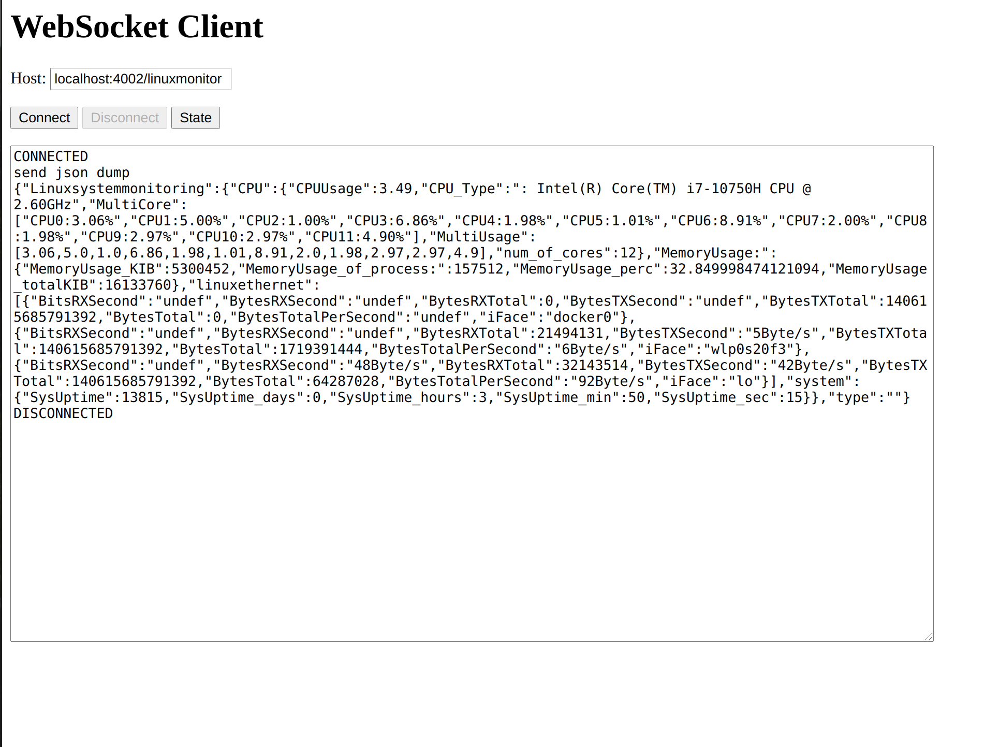

# Websocket Linuxmonitor

This app consists of a Websocket Server and the linux system monitor. The System load is read out at an given interval 
and will be sent to all connected websockets. 
The websocket Server as well as the linuxmonitor runs in an own thread. Data between these two threads are transferred via
observer pattern and mutex lock.

This application consists of the following libs:
* [cxxopts - argument parser lib](https://github.com/jarro2783/cxxopts)
* [nlohmann json - very handy json lib](https://github.com/nlohmann/json)
* [quicktype - json object to cpp code](https://app.quicktype.io/)
* [uWebsockets - handy lightweight high performance websocket lib](https://github.com/uNetworking/uWebSockets)
* [uSockets - socket lib which uWebsockets built on top](https://github.com/uNetworking/uSockets)

#### Parameter:
    -d debug         "Enable debugging"
    -c public_cert   "path to public cert"
    -k private_key   "path to private key"
    -p websocketport_num  "Port to listen on"
    -i sendInterval  "sendInterval where data sent out in milliseconds"
    -b basepath  "Path to access the kernel information" 
    
    
#### Connect to Websocket Server via websocketclient.html example:
Enter Websocket URL:       
    
    localhost:4002/linuxmonitor

